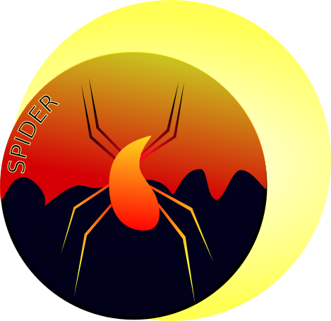

# SPIDER

**SPIDER** is the interior dynamics module of the [PROTEUS](https://proteus-framework.org/PROTEUS) coupled atmosphere-interior evolution framework. It is a 1-D parameterised interior dynamics code for rocky planets with molten and/or solid interiors, with support for volatile cycling, redox reactions, and radiative transfer in the atmosphere. Simulating Planetary Interior Dynamics with Extreme Rheology.

  

!!! note 
    This documentation describes the version of SPIDER as part of the [PROTEUS Framework](https://proteus-framework.org/PROTEUS). For the original SPIDER code, see [djbower/SPIDER](https://github.com/djbower/spider).

If you plan to contribute to SPIDER, please read our [Code of Conduct](Community/CODE_OF_CONDUCT.md).
If you are running into problems, please do not hesitate to raise an [Issue](https://github.com/FormingWorlds/SPIDER/issues).

## Copyright

See [the included license](COPYING).
Copyright 2021 Daniel J. Bower and Patrick Sanan.